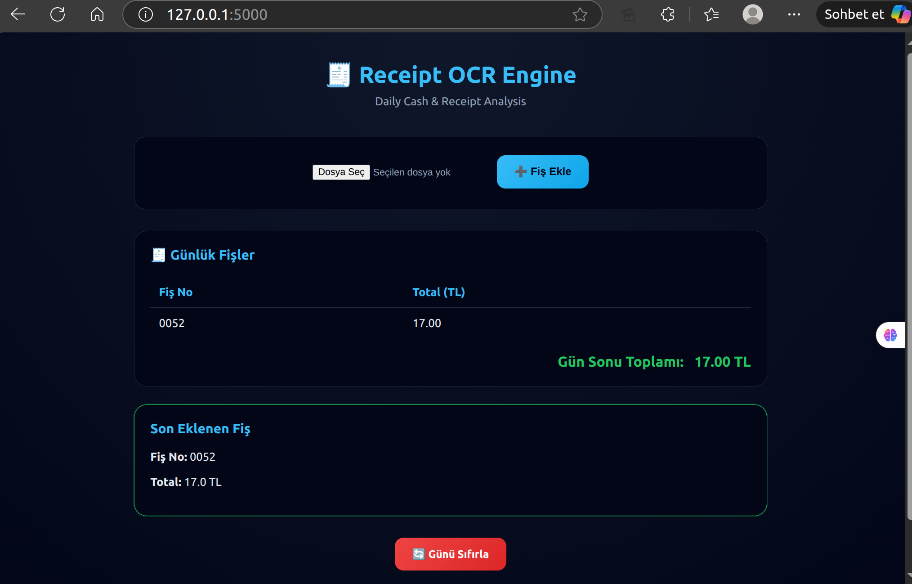

# Receipt Demo - Fiş OCR ve Analiz Uygulaması

Bu proje, Türkçe fiş görüntülerini OCR (Optical Character Recognition) teknolojisi kullanarak okuma, analiz etme ve günlük toplam hesaplama işlemlerini gerçekleştiren bir Flask web uygulamasıdır.

## 📋 Özellikler

- **OCR Desteği**: Tesseract OCR kullanarak fiş görüntülerinden metin çıkarma
- **Otomatik Parsing**: Fiş numarası, tarih, saat, toplam tutar, ürün bilgileri gibi verileri otomatik olarak çıkarma
- **Günlük Takip**: Gün içinde okunan tüm fişleri takip etme ve gün sonu toplamını hesaplama
- **Web Arayüzü**: Kullanıcı dostu web arayüzü ile fiş yükleme ve görüntüleme
- **Veri Dışa Aktarma**: JSON, CSV ve Excel formatlarında veri dışa aktarma desteği

## 🛠️ Gereksinimler

### Sistem Gereksinimleri

- Python 3.7 veya üzeri
- Tesseract OCR (sistem seviyesinde kurulu olmalı)
- Tesseract Türkçe dil paketi

### Python Paketleri

- Flask
- opencv-python
- pytesseract
- pandas
- openpyxl

## 📦 Kurulum

### 1. Tesseract OCR Kurulumu

#### Ubuntu/Debian:
```bash
sudo apt-get update
sudo apt-get install tesseract-ocr
sudo apt-get install tesseract-ocr-tur
```

#### macOS:
```bash
brew install tesseract
brew install tesseract-lang
```

#### Windows:
[Windows installer](https://github.com/UB-Mannheim/tesseract/wiki) indirip kurun ve Türkçe dil paketini ekleyin.

### 2. Python Bağımlılıklarını Kurma

```bash
# Proje dizinine gidin
cd receipt_demo

# Virtual environment oluşturun (önerilir)
python3 -m venv venv
source venv/bin/activate  # Linux/Mac
# veya
venv\Scripts\activate  # Windows

# Gerekli paketleri kurun
pip install flask opencv-python pytesseract pandas openpyxl
```

Alternatif olarak, `requirements.txt` dosyası oluşturulduysa:

```bash
pip install -r requirements.txt
```

## 🚀 Çalıştırma

### 1. Uygulamayı Başlatma

```bash
python app.py
```

Uygulama varsayılan olarak `http://127.0.0.1:5000` adresinde çalışacaktır.

### 2. Tarayıcıda Açma

Web tarayıcınızda `http://localhost:5000` adresine gidin.

### 3. Fiş Yükleme

- Ana sayfada "Fiş Ekle" butonuna tıklayın
- Fiş görüntüsünü seçin ve yükleyin
- Sistem otomatik olarak fişi analiz edecek ve sonuçları gösterecektir

## 📁 Proje Yapısı

```
receipt_demo/
├── app.py                 # Flask ana uygulama dosyası
├── receipt_ocr.py         # OCR işlemleri için sınıf
├── receipt_parser.py      # Fiş verilerini parse etme sınıfı
├── receipt_exporter.py    # Veri dışa aktarma sınıfı
├── templates/             # HTML şablonları
│   ├── base.html
│   └── index.html
├── static/                # CSS ve statik dosyalar
│   └── style.css
├── uploads/               # Yüklenen fiş görüntüleri
└── outputs/               # Dışa aktarılan veriler
```

## 🔧 Yapılandırma

### Tesseract Yolu

Eğer Tesseract farklı bir konumda kuruluysa, `app.py` dosyasındaki Tesseract yolunu güncelleyin:

```python
ocr = ReceiptOCR("/usr/bin/tesseract", "--oem 3 --psm 6")
```

Windows için örnek:
```python
ocr = ReceiptOCR("C:\\Program Files\\Tesseract-OCR\\tesseract.exe", "--oem 3 --psm 6")
```

### OCR Parametreleri

OCR performansını artırmak için `--oem` ve `--psm` parametrelerini değiştirebilirsiniz:
- `--oem 3`: Varsayılan OCR motoru
- `--psm 6`: Tek düzgün metin bloğu varsayımı

## 📊 Çıkarılan Veriler

Uygulama fişlerden şu bilgileri çıkarır:

- **Market Bilgisi**: Fiş üzerindeki market adı ve bilgileri
- **Tarih**: Fiş tarihi
- **Saat**: Fiş saati
- **Fiş No**: Fiş numarası
- **Ürün Kodu**: EAN barkod numarası
- **Ürün**: Ürün adı ve fiyatı
- **Toplam**: Toplam tutar
- **Kasiyer Bilgisi**: Kasiyer adı
- **Kasa Bilgisi**: Kasa numarası

## 🎯 Kullanım Senaryoları

1. **Günlük Fiş Takibi**: Gün içinde alınan tüm fişleri yükleyerek gün sonu toplamını hesaplayın
2. **Veri Analizi**: Dışa aktarılan JSON, CSV veya Excel dosyalarını kullanarak detaylı analiz yapın
3. **Maliyet Takibi**: Günlük harcamaları takip edin ve raporlayın

## 🔄 Günü Sıfırlama

"Günü Sıfırla" butonuna tıklayarak günlük fiş listesini temizleyebilirsiniz.

## ⚠️ Notlar

- OCR doğruluğu görüntü kalitesine bağlıdır
- Düşük kaliteli veya bulanık görüntülerde hata oranı artabilir
- Tesseract Türkçe dil paketinin kurulu olması önemlidir
- Görüntü ön işleme (denoising) otomatik olarak yapılmaktadır

## 🐛 Sorun Giderme

### Tesseract Bulunamadı Hatası

Tesseract'ın sistem PATH'inde olduğundan veya `app.py`'de doğru yolun belirtildiğinden emin olun.

### Türkçe Karakter Sorunları

Tesseract Türkçe dil paketinin (`tesseract-ocr-tur`) kurulu olduğundan emin olun.

### Görüntü Okunamıyor Hatası

- Görüntü formatının desteklendiğinden emin olun (JPG, PNG, etc.)
- Görüntü dosyasının bozuk olmadığını kontrol edin

## 📝 Lisans

Bu proje eğitim ve demo amaçlıdır.

## 📸 Ekran Görüntüsü



